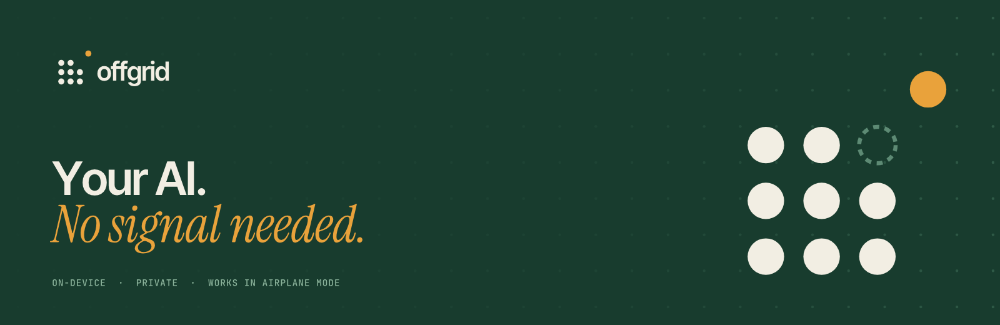

<p align="center"></p>

# Offgrid

A private AI chat app for iPhone that runs entirely on the device. Download a model once, then chat in airplane mode: no account, no servers, and your conversations never leave the phone.

- **Engine:** [llama.cpp](https://github.com/ggml-org/llama.cpp) with Metal GPU acceleration
- **Models:** Qwen3.5 0.8B, 2B (default) and 4B, downloaded in-app and checked against a pinned SHA-256
- **App:** SwiftUI + SwiftData, iOS 17+, iPhone 15 Pro or newer recommended

## Features

- Streaming answers with Markdown, code blocks and copy buttons
- Optional "think before answering" mode, with the reasoning shown in a collapsible section
- Chat history stored locally, with search
- Background model downloads that resume after interruptions
- Automatic context management: older messages are dropped when a chat outgrows the model's memory, and the model's memory of the conversation is reused between turns when possible, so follow-ups start faster
- Settings for creativity, context length, reply length and the model's instructions

## How it's built

There's no Mac required to build: GitHub Actions does it.

1. `scripts/build-llama.sh` compiles llama.cpp (pinned in `scripts/llama-version.txt`) into `Vendor/llama.xcframework`. CI caches this, so it only runs when the pin changes.
2. [XcodeGen](https://github.com/yonaskolb/XcodeGen) turns `project.yml` into `Offgrid.xcodeproj`.
3. CI runs the unit tests on a simulator and builds an unsigned iPhone `.ipa`, which you can download from the run's **Artifacts**.

On a Mac with Xcode 16+:

```sh
brew install xcodegen cmake
scripts/build-llama.sh
xcodegen generate
open Offgrid.xcodeproj
```

## Installing on an iPhone

Apple only runs signed apps. Two options:

- **Apple Developer Program (paid):** add signing secrets to the repo and CI can upload each build to TestFlight (not set up yet).
- **Free Apple ID:** sideload the unsigned `.ipa` with a tool such as Sideloadly from a Windows or Mac computer. Free-account installs expire after 7 days, and the larger-memory entitlement isn't available, so stick to the 0.8B or 2B model.

## Project layout

```
App/
  Engine/     llama.cpp wrapper (LlamaEngine), prompt helpers
  Models/     model catalog, downloads and checksum verification
  Chat/       generation controller, Markdown parser
  Store/      SwiftData models for chats
  UI/         SwiftUI screens
Tests/        unit tests (run in CI)
scripts/      llama.cpp build, simulator picker
```

## Limits

Small on-device models are much weaker than cloud assistants. They can be wrong with confidence and they don't know recent events. Treat answers as a starting point.

See [THIRD_PARTY_NOTICES.md](THIRD_PARTY_NOTICES.md) for licenses.

## Brand

Logo, app icon and banners live in [`branding/`](branding/). Palette: forest `#183c2e`, deep `#0e261d`, cream `#f2eee3`, signal amber `#e9a23b`, sage `#8db59d`. Type: Inter Tight (wordmark), Instrument Serif italic (accent), JetBrains Mono (labels). Regenerate with `branding/source/make_brand.py` and `render.js`.
